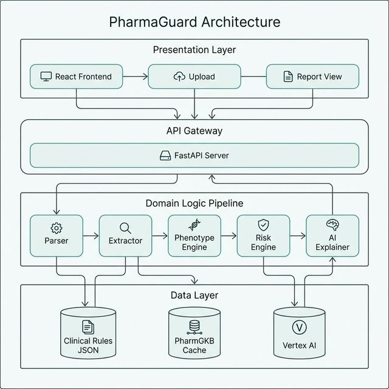

# PharmaGuard AI

Pharmacogenomics risk analysis platform for VCF-driven, drug-specific clinical guidance.

## Architecture



## What It Does

- Parses real VCF files and extracts pharmacogenomic variants.
- Builds diplotypes/phenotypes for 6 target genes.
- Maps phenotype + drug to actionable risk labels.
- Returns strict, evaluator-friendly JSON output.
- Generates clinician + patient explanation text (LLM + deterministic fallback).

## Core Pipeline

1. `vcf_parser.py` - parse, validate, quality-filter variants
2. `variant_extractor.py` - gene grouping, zygosity, diplotype assembly
3. `pypgx_engine.py` - phenotype calling via local PGx mapping engine
4. `pharmgkb_lookup.py` - evidence/annotation lookup from local PharmGKB cache
5. `risk_engine.py` - rule-based risk + recommendation selection
6. `llm_explainer.py` - MedGemma/FunctionGemma narrative with fallback
7. `schemas.py` - strict Pydantic validation

## Supported Scope

- Genes: `CYP2D6`, `CYP2C19`, `CYP2C9`, `SLCO1B1`, `TPMT`, `DPYD`
- Drugs: `CODEINE`, `CLOPIDOGREL`, `WARFARIN`, `SIMVASTATIN`, `AZATHIOPRINE`, `FLUOROURACIL`
- Risk labels: `Safe`, `Adjust Dosage`, `Toxic`, `Ineffective`, `Unknown`
- Severity: `none`, `low`, `moderate`, `high`, `critical`

## Repository Layout

```text
pwioi/
├── backend/
│   ├── main.py
│   ├── pyproject.toml
│   ├── uv.lock
│   ├── Dockerfile
│   ├── models/
│   ├── pipeline/
│   ├── tests/
│   └── data/
├── frontend/
│   ├── src/
│   ├── Dockerfile
│   └── nginx.conf
├── sample_vcf/
├── docker-compose.yml
├── .env.example
└── README.md
```

## Local Run (uv + npm)

Backend:

```powershell
cd backend
uv sync
uv run uvicorn main:app --host 0.0.0.0 --port 8000 --reload
```

Frontend:

```powershell
cd frontend
npm install
npm run dev
```

Open `http://localhost:5173`.

## Docker Run (Monorepo)

```powershell
cp .env.example .env
docker compose up -d --build
```

- Frontend: `http://localhost:5173`
- Backend: `http://localhost:8000/health`

## API

- `POST /analyze`
- `POST /analyze-strict`
- `POST /evidence-trace`
- `POST /explanation-quality`
- `POST /normalize-drug`
- `POST /phenoconversion-check`
- `POST /cohort-summary`
- `GET /supported-drugs`
- `GET /sample-vcf/{type}`
- `GET /health`

Example:

```bash
curl -X POST http://localhost:8000/analyze \
  -F "vcf_file=@sample_vcf/patient_pm_cyp2d6.vcf" \
  -F "drugs=CODEINE" \
  -F "concurrent_medications=fluoxetine,omeprazole"
```

## Required Strict Output Shape

Each analysis result is returned as one object:

```json
{
  "patient_id": "PATIENT_XXX",
  "drug": "DRUG_NAME",
  "timestamp": "ISO8601_timestamp",
  "risk_assessment": {
    "risk_label": "Safe|Adjust Dosage|Toxic|Ineffective|Unknown",
    "confidence_score": 0.0,
    "severity": "none|low|moderate|high|critical"
  },
  "pharmacogenomic_profile": {
    "primary_gene": "GENE_SYMBOL",
    "diplotype": "*X/*Y",
    "phenotype": "PM|IM|NM|RM|URM|Unknown",
    "detected_variants": []
  },
  "clinical_recommendation": {},
  "llm_generated_explanation": {},
  "quality_metrics": {
    "vcf_parsing_success": true
  }
}
```

## Environment Variables

Core:

- `VITE_API_URL`
- `CORS_ORIGINS`
- `ENABLE_LLM_EXPLANATIONS`

Vertex LLM (optional):

- `VERTEX_PROJECT`
- `MEDGEMMA_ENDPOINT_ID`
- `MEDGEMMA_LOCATION`
- `FUNCGEMMA_ENDPOINT_ID`
- `FUNCGEMMA_LOCATION`
- `GOOGLE_APPLICATION_CREDENTIALS`
- `GOOGLE_CREDENTIALS_BASE64`

## Testing

```powershell
cd backend
uv run python -m unittest discover -s tests -v
```

## Security Notes

- Do not commit credentials, private keys, or service account JSON files.
- Keep `.env` local only.
- Rotate any key that has ever been pasted in chat, logs, or screenshots.
